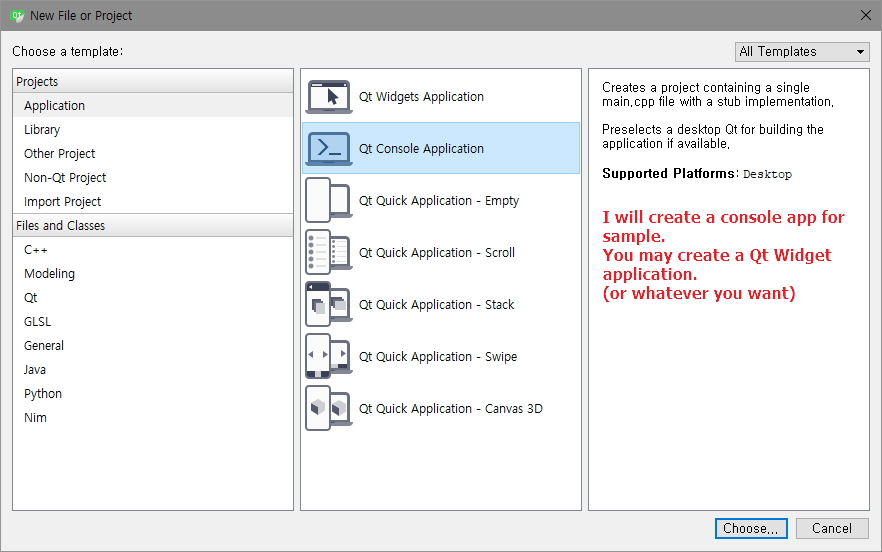
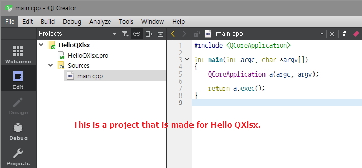
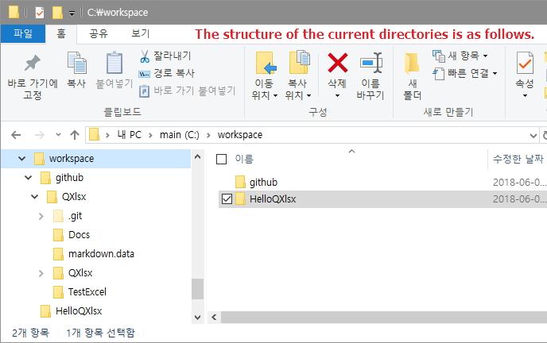
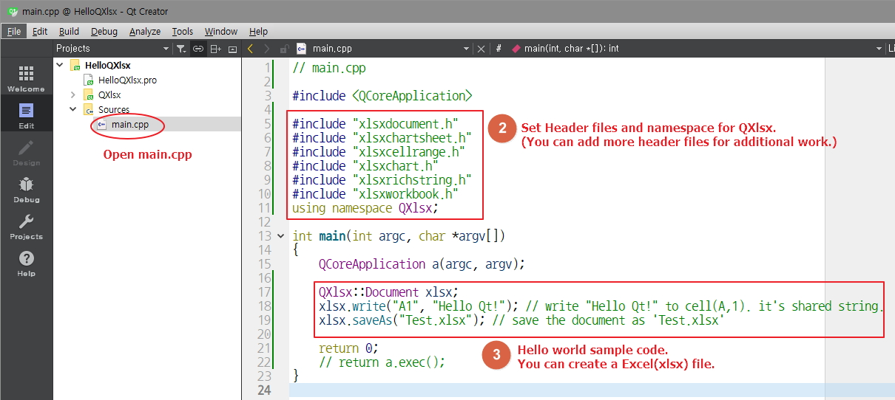
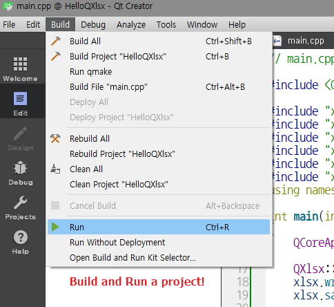

## How to setup QXlsx project

- Here's an easy way to apply QXlsx.
- Describes when to apply to Windows.
- The method of applying it on Linux or Mac is similar, and I will write help if there is an additional request.
- * Hi! I'm j2doll. My native language is not English and my English is not fluent. Please understand if I misunderstood the explanation :-)

## Steps to set

:one: Clone source code from github

```sh
git clone https://github.com/j2doll/QXlsx.git
```


<br /><br />

:two: Execute QtCreator


* If you don't know use QtCreator, see Qt Company site. [https://www.qt.io/qt-features-libraries-apis-tools-and-ide/](https://www.qt.io/qt-features-libraries-apis-tools-and-ide/)

<br /><br />

:three: Create your own Qt Project.


<br /><br />

:four: Sample is console application.



<br /><br />

:five: Set project name. Current project name is HelloQXlsx.  


<br /><br />

:six: HelloQXlsx project has been created.



<br /><br />

:seven: Current directory for project



<br /><br />

:eight: Copy QXlsx code to your app project  


<br /><br />

:nine: Current directories and files for project


<br /><br />

10. Append code for QXlxs library on your Qt project(*.pro)


```qmake
# QXlsx code for Application Qt project
QXLSX_PARENTPATH=./         # current QXlsx path is . (. means curret directory)
QXLSX_HEADERPATH=./header/  # current QXlsx header path is ./header/
QXLSX_SOURCEPATH=./source/  # current QXlsx source path is ./source/
include(./QXlsx.pri)
```

<br /><br />

11. Set heaer files and namespace for sample. Then append hello world code.



```cpp
// main.cpp

#include <QCoreApplication>

#include "xlsxdocument.h"
#include "xlsxchartsheet.h"
#include "xlsxcellrange.h"
#include "xlsxchart.h"
#include "xlsxrichstring.h"
#include "xlsxworkbook.h"
using namespace QXlsx;

int main(int argc, char *argv[])
{
    QCoreApplication a(argc, argv);

    QXlsx::Document xlsx;
    xlsx.write("A1", "Hello Qt!"); // write "Hello Qt!" to cell(A,1). it's shared string.
    xlsx.saveAs("Test.xlsx"); // save the document as 'Test.xlsx'

    return 0;
    // return a.exec();
}
```

<br /><br />

12. Build and Run a project



<br /><br />

13. Execute file and Excel file(xlsx) is created.


<br /><br />
