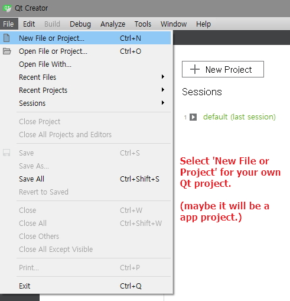
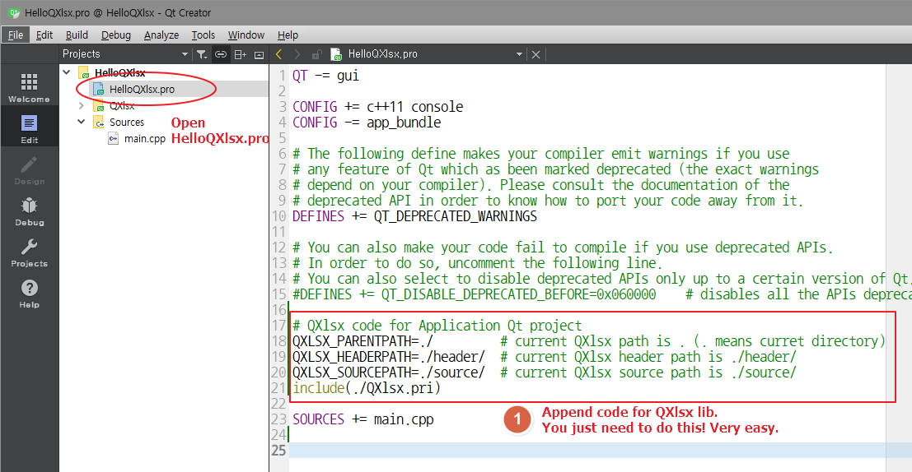
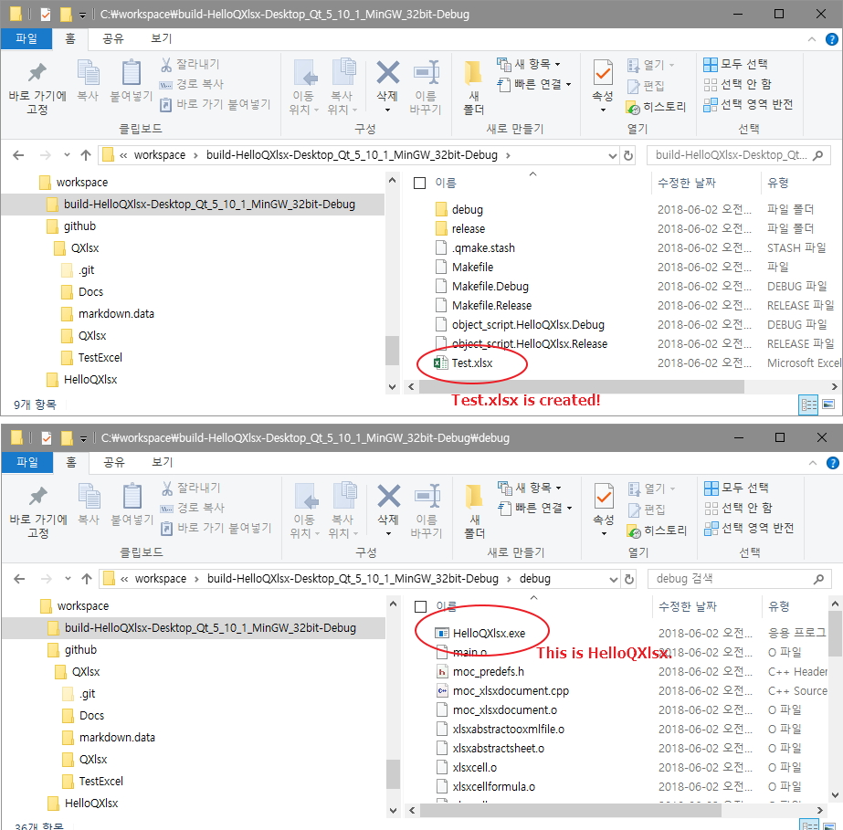

## How to setup QXlsx project

- Here's an easy way to apply QXlsx.
- Describes when to apply to Windows.
- The method of applying it on Linux or Mac is similar, and I will write help if there is an additional request.
- * Hi! I'm j2doll. My native language is not English and my English is not fluent. Please understand if I misunderstood the explanation :-)

## Step

:one: Clone source code from github

```sh
git clone https://github.com/j2doll/QXlsx.git
```


<br /><br />

:two: Execute QtCreator


* If you don't know use QtCreator, see Qt Company site. [https://www.qt.io/qt-features-libraries-apis-tools-and-ide/](https://www.qt.io/qt-features-libraries-apis-tools-and-ide/)

:three: Create your own Qt Project.



:four: Sample is console application.


:five: Set project name. Current project name is HelloQXlsx.  


:six: HelloQXlsx project has been created.


:seven: Current directory for project


:eight: Copy QXlsx code to your app project  


:nine: Current directories and files for project


10. Append code for QXlxs library on your Qt project(*.pro)



11. Set heaer files and namespace for sample. Then append hello world code.


12. Build and Run a project


13. Execute file and Excel file(xlsx) is created.


